=====================================
Installation and Administration Guide
=====================================

------------
Introduction
------------

This installation and administration guide covers the Business API Ecosystem version 6.4.0, corresponding to FIWARE release 6.
Any feedback on this document is highly welcomed, including bugs, typos or things you think should be included but aren't.
Please send them to the "Contact Person" email that appears in the `Catalogue page for this GEi`_. Or create an issue at `GitHub Issues`_

.. _Catalogue page for this GEi: https://catalogue.fiware.org/enablers/business-api-ecosystem-biz-ecosystem-ri
.. _GitHub Issues: https://github.com/FIWARE-TMForum/Business-API-Ecosystem/issues/new

The current version of the software has been tested under Ubuntu 14.04, Ubuntu 15.10, Ubuntu 16.04, Debian 7, Debian 8,
and CentOS 7. THESE ARE THEREFORE CONSIDERED AS THE SUPPORTED OPERATING SYSTEMS.

------------
Installation
------------

Requirements
============

As described in the GEri overview, the Business API Ecosystem is not a single software, but a set of projects that
work together for proving business capabilities. In this regard, this section contains the basic dependencies of
the different components that made up the Business API Ecosystem.

.. note::
    These dependencies are not mean to be installed manually in this step, as they will be installed throughout the documentation

TM Forum APIs and RSS requirements
----------------------------------

* Java 8
* Glassfish 4.1
* MySQL 5.5

Charging Backend requirements
-----------------------------

* Python 2.7
* MongoDB
* wkhtmltopdf

Logic Proxy requirements
------------------------

* NodeJS 4.5.0+ (Including NPM)

Installing basic dependencies
=============================

Basic dependencies such as Java 8, Glassfish, MySQL, Python, etc. Can be installed using the package management tools
provided by your operating system. However, in order to easy the installation process some scripts have been provided.

.. note::
    The installation script may override some of the packages already installed in the system. so if you have software with common dependencies you may want to manually resolve them.

Installing basic dependencies using the script
----------------------------------------------

In order to automate the installation of the basic dependencies, the script *setup_env.sh* has been provided. This
script, located in the root directory, installs all the needed packages for Ubuntu, Debian, and CentOS systems.

Additionally, this script creates a directory */opt/biz-ecosystem* where Glassfish 4.1 and Node 6.9.1 are downloaded,
creates a */etc/default/rss* directory used later for properties files, and sets up the PATH environment in your .bashrc file.

.. note::
    The installation script changes the owner of all its created directories to your current user

To execute the script, run the following command from the root directory of the project ::

    $ ./setup_env.sh

.. note::
   Do not execute the script using sudo, for those tasks which require root privileges the script will prompt you to provide your sudo password

During the execution of the script you will be prompted some times in order to accept Oracle Java 8 terms and conditions
and to provide MySQL root password.

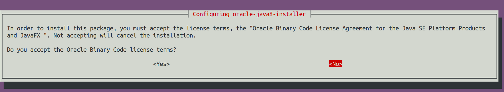

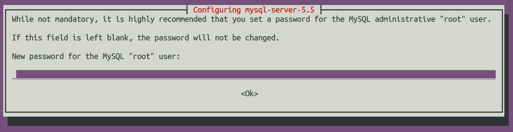

Installing basic dependencies manually
--------------------------------------

Following, you can find how to install the basic dependencies without using the script. Be aware that some commands require to
be executed as root.

APIs dependencies
+++++++++++++++++

**Java 8 Debian/Ubuntu**

To install Java 8 in a Debian or Ubuntu system, it is needed to include the *webupd8team* repository. In an Ubuntu system this can be done
directly with the following command::

    $ sudo add-apt-repository ppa:webupd8team/java

In the case you have a Debian system the following commands have to be executed ::

    $ sudo echo "deb http://ppa.launchpad.net/webupd8team/java/ubuntu trusty main" | tee /etc/apt/sources.list.d/webupd8team-java.list
    $ sudo echo "deb-src http://ppa.launchpad.net/webupd8team/java/ubuntu trusty main" | tee -a /etc/apt/sources.list.d/webupd8team-java.list
    $ sudo apt-key adv --keyserver hkp://keyserver.ubuntu.com:80 --recv-keys EEA14886

Then Java 8 can be installed using the following commands::

    $ sudo apt-get update
    $ sudo apt-get install -y oracle-java8-installer
    $ sudo apt-get install -y oracle-java8-set-default

**Java 8 CentOS 7**

For a CentOS 7 system, the installation of Java 8 requires downloading the package from the official site ::

    $ wget --no-cookies --no-check-certificate --header "Cookie: gpw_e24=http%3A%2F%2Fwww.oracle.com%2F; oraclelicense=accept-securebackup-cookie" "http://download.oracle.com/otn-pub/java/jdk/8u102-b14/jdk-8u102-linux-x64.tar.gz"
    $ tar xzf jdk-8u102-linux-x64.tar.gz

Then Java can be installed using *alternatives* ::

    $ sudo alternatives --install /usr/bin/java java /opt/biz-ecosystem/jdk1.8.0_102/bin/java 2
    $ sudo alternatives --config java

    $ sudo alternatives --install /usr/bin/jar jar /opt/biz-ecosystem/jdk1.8.0_102/bin/jar 2
    $ sudo alternatives --install /usr/bin/javac javac /opt/biz-ecosystem/jdk1.8.0_102/bin/javac 2
    $ sudo alternatives --set jar /opt/biz-ecosystem/jdk1.8.0_102/bin/jar
    $ sudo alternatives --set javac /opt/biz-ecosystem/jdk1.8.0_102/bin/javac

**MySQL and Maven Debian/Ubuntu**
Once Java has been installed, the next step is installing MySQL and Maven ::

    $ sudo apt-get install -y mysql-server mysql-client
    $ sudo apt-get install -y maven

**MySQL and Maven CentOS 7**

For installing MySQL in CentOS, it is required to include the related repository before installing it ::

    $ wget http://repo.mysql.com/mysql-community-release-el7-5.noarch.rpm
    $ sudo rpm -ivh mysql-community-release-el7-5.noarch.rpm
    $ sudo yum update

    $ sudo yum install -y mysql-community-server

Then, for installing Maven ::

    $ sudo wget http://repos.fedorapeople.org/repos/dchen/apache-maven/epel-apache-maven.repo -O /etc/yum.repos.d/epel-apache-maven.repo
    $ sudo sed -i s/\$releasever/6/g /etc/yum.repos.d/epel-apache-maven.repo
    $ sudo yum install -y apache-maven

**Glassfish**
The next step is downloading and extracting Glassfish ::

    $ wget http://download.java.net/glassfish/4.1/release/glassfish-4.1.zip
    $ unzip glassfish-4.1.zip

Finally, it is required to download the MySQL connector for Glassfish and include it within the Glassfish *lib* directory ::

    $ wget http://dev.mysql.com/get/Downloads/Connector-J/mysql-connector-java-5.1.39.tar.gz

    $ gunzip mysql-connector-java-5.1.39.tar.gz
    $ tar -xvf mysql-connector-java-5.1.39.tar

    $ cp mysql-connector-java-5.1.39/mysql-connector-java-5.1.39-bin.jar glassfish4/glassfish/lib

Charging Backend dependencies
+++++++++++++++++++++++++++++

**Python 2.7 Debian/Ubuntu**

To install Python 2.7 and Pip in a Debian/Ubuntu distribution, execute the following command ::

    $ sudo apt-get install -y python python-pip

**Python 2.7 CentOS**

Python 2.7 is included by default in CentOS 7. To install Pip it is required to include EPEL repository.
All this stuff can be done executing the following commands ::

    $ sudo rpm -iUvh http://dl.fedoraproject.org/pub/epel/7/x86_64/e/epel-release-7-5.noarch.rpm
    $ sudo yum -y update
    $ sudo yum install -y python-pip

**MongoDB Debian/Ubuntu**

To install MongoDB in a Debian/Ubuntu distribution, execute the following command ::

    $ sudo apt-get install -y mongodb

**MongoDB CentOS 7**

To install MongoDB in CentOS it is needed to include its repository first. MongoDB can be installed executing the following commands ::

    $ sudo echo "[mongodb]
    name=MongoDB Repository
    baseurl=http://downloads-distro.mongodb.org/repo/redhat/os/x86_64/
    gpgcheck=0
    enabled=1" > /etc/yum.repos.d/mongodb.repo

    $ sudo yum install -y mongodb-org

**Wkhtmltopdf Debian/Ubuntu**

In Debian and Ubuntu Wkhtmltopdf is included in a package, so it can be directly installed with the following command ::

    $ sudo apt-get install -y wkhtmltopdf

**Wkhtmltopdf CentOS 7**

In CentOS the Wkhtmltopdf RPM package has to be downloaded for installing it ::

    $ wget http://download.gna.org/wkhtmltopdf/0.12/0.12.1/wkhtmltox-0.12.1_linux-centos7-amd64.rpm
    $ sudo rpm -ivh wkhtmltox-0.12.1_linux-centos7-amd64.rpm

Logic Proxy Dependencies
++++++++++++++++++++++++

For installing Node and NPM it is needed to download the binaries from the official site and uncompress them ::

    $ wget https://nodejs.org/dist/v6.9.1/node-v6.9.1-linux-x64.tar.xz
    $ tar -xvf node-v6.9.1-linux-x64.tar.xz

Installing the Business API Ecosystem
=====================================

As stated previously, the Business API Ecosystem is composed of different systems that need to be installed separately.
In order to easy this process, it has been created an script **install.py** which can be used to automate the installation.

Installing the Business API Ecosystem using the script
------------------------------------------------------

The script *install.py* is located at the root of the Business API Ecosystem project. This script provides functionality
to automate the installation of the software. Concretely, it downloads all the APIs and components, compiles and deploys
the APIs, and installs python and node libraries.

This script depends on Python3 to work. If you have used the *setup_env.sh* script, Python 3 is already installed.
Otherwise, you can install Python 3 using the following commands:

**Debian/Ubuntu** ::

    $ sudo apt-get install -y python3
    $ sudo apt-get install -y python3-pip

**CentOS 7** ::

    $ sudo yum -y install scl-utils
    $ sudo rpm -Uvh https://www.softwarecollections.org/en/scls/rhscl/python33/epel-7-x86_64/download/rhscl-python33-epel-7-x86_64.noarch.rpm
    $ sudo yum -y install python33

Additionally, *install.py* specs the binaries of Glassfish and Node to be included in the PATH, and need to be accessible
by the user using the script. This can be done with the following commands (Note that the commands are supposing both or them are installed at */opt/biz-ecosystem*) ::

    $ export PATH=$PATH:/opt/biz-ecosystem/glassfish4/glassfish/bin
    $ export PATH=$PATH:/opt/biz-ecosystem/node-6.9.1-linux-x64/bin

    $ sudo chown -R <your_user>:<your_user> /opt/biz-ecosystem

If you have used *setup_env.sh**, the Glassfish installation directory already belongs to your user. In addition, the
export PATH command has been included in your bashrc, so to have Node and Glassfish in the PATH execute the following
command: ::

    $ source ~/.bashrc

Moreover, *install.py* requires Glassfish, MySQL and MongoDB to be up and running.

**Debian/Ubuntu** ::

    $ asadmin start-domain
    $ sudo service mysql restart
    $ sudo service mongodb restart

**CentOS 7** ::

    $ asadmin start-domain
    $ sudo systemctl start mysqld
    $ sudo systemctl start mongod

Finally, during the deployment of the RSS API, the script saves the properties file in the default RSS properties directory.
If you have used *setup_env.sh* this directory already exists. Otherwise, you have to manually create the directory
*/etc/default/rss*, being required to have root privileges to create it. Moreover, this directory must be accessible by
the user executing the script. To do that ::

    $ sudo mkdir /etc/default/rss
    $ sudo chown <your_user>:<your_user> /etc/default/rss

The script *install.py* creates the different databases as well as the connection pools and resources. In this regard,
after the execution of the script all the APIs will be already configured. You can specify the database settings by modifying the
script and updating DBUSER, DBPWD, DBHOST, and DBPORT, which by default contains the following configuration. ::

    DBUSER = "root"
    DBPWD = "toor"
    DBHOST = "localhost"
    DBPORT = 3306

To make a complete installation of the Business API Ecosystem, execute the following command ::

    $ ./install.py all

In addition to the *all* option, *install.py* also provides several options that allows to execute parts of the installation
process, so you can have more control over it. Concretely, the script provides the following options:

* **clone**: Downloads from GitHub the different components of the Business API Ecosystem
* **maven**: Compiles the downloaded APIs using Maven
* **tables**: Creates the required databases in MySQL
* **persistence**: Builds persistence.xml files of the different APIs
* **pools**: Creates database pools in Glassfish
* **resources**: Creates database resources in Glassfish
* **redeploy**: Deploys APIs and RSS war files in Glassfish
* **proxy**: Installs proxy Node libs
* **charging**: Installs charging Python libs

Installing the Business API Ecosystem Manually
----------------------------------------------

Installing TM Forum APIs
++++++++++++++++++++++++

The different reference implementations of the TM Forum APIs used in the Business API Ecosystem are available in GitHub:

* `Catalog Management API <https://github.com/FIWARE-TMForum/DSPRODUCTCATALOG2>`__
* `Product Ordering Management API <https://github.com/FIWARE-TMForum/DSPRODUCTORDERING>`__
* `Product Inventory Management API <https://github.com/FIWARE-TMForum/DSPRODUCTINVENTORY>`__
* `Party Management API <https://github.com/FIWARE-TMForum/DSPARTYMANAGEMENT>`__
* `Customer Management API <https://github.com/FIWARE-TMForum/DSCUSTOMER>`__
* `Billing Management API <https://github.com/FIWARE-TMForum/DSBILLINGMANAGEMENT>`__
* `Usage Management API <https://github.com/FIWARE-TMForum/DSUSAGEMANAGEMENT>`__

The installation for all of them is similar. The first step is cloning the repository and moving to the correct release ::

    $ git clone https://github.com/FIWARE-TMForum/DSPRODUCTCATALOG2.git
    $ cd DSPRODUCTCATALOG2
    $ git checkout v6.4.0

Once the software has been downloaded, it is needed to create the connection to the database. To do that, the first step
is editing the *src/main/resources/META-INF/persistence.xml* to have something similar to the following: ::

    <?xml version="1.0" encoding="UTF-8"?>
    <persistence version="2.1" xmlns="http://xmlns.jcp.org/xml/ns/persistence" xmlns:xsi="http://www.w3.org/2001/XMLSchema-instance" xsi:schemaLocation="http://xmlns.jcp.org/xml/ns/persistence http://xmlns.jcp.org/xml/ns/persistence/persistence_2_1.xsd">
        <persistence-unit name="DSProductCatalogPU" transaction-type="JTA">
            <jta-data-source>jdbc/pcatv2</jta-data-source>
            <exclude-unlisted-classes>false</exclude-unlisted-classes>
            <properties>
                <property name="javax.persistence.schema-generation.database.action" value="drop-and-create"/>
            </properties>
        </persistence-unit>
    </persistence>

Note that you should provide in the tag *jta-data-source* the name you want for your database connection resource, taking into account
that it must be unique for each API.

The next step is creating the database for you API. ::

    $ mysql-u <user> -p<passwd> "CREATE DATABASE IF NOT EXISTS <database>"

.. note::
    You have to provide your own credentials and the selected database name to the previous command.

Once that the database has been created, the next step is creating the connection pool in Glassfish. To do that, you can
use the following command: ::

    $ asadmin create-jdbc-connection-pool --restype java.sql.Driver --driverclassname com.mysql.jdbc.Driver --property user=<user>:password=<passwd>:URL=jdbc:mysql://<host>:<port>/<database> <poolname>

.. note::
    You have to provide you own database credentials, the database host, the database port, the database name of the one created previously, and a name for your pool

The last step for creating the database connection is creating the connection resource. To do that, execute the following command: ::

    $ asadmin create-jdbc-resource --connectionpoolid <poolname> <jndiname>

.. note::
    You have to provide the name of the pool you have previously created and a name for your resource, which has to be the same
    as the included in the *jta-data-source* tag of the *persistence.xml* file of the API.

When the database connection has been created, the next step is compiling the API sources with Maven ::

    $ mvn install

Finally, the last step is deploying the generated war file in Glassfish ::

    $ asadmin deploy --contextroot <root> --name <root> target/<WAR.war>

.. note::
    You have to provide the wanted context root for the API, a name for it, and the path to the war file

Installing the RSS
++++++++++++++++++

The RSS sources can be found in `GitHub <https://github.com/FIWARE-TMForum/business-ecosystem-rss>`__

The first step for installing the RSS component is downloading it and moving to the correct release ::

    $ git clone https://github.com/FIWARE-TMForum/business-ecosystem-rss.git
    $ cd business-ecosystem-rss
    $ git checkout v6.4.0

Then, the next step is coping, *database.properties* and *oauth.properties* files to its default location at */etc/default/rss* ::

    $ sudo mkdir /etc/default/rss
    $ sudo chown <your_user>:<your_user> /etc/default/rss
    $ cp properties/database.properties /etc/default/rss/database.properties
    $ cp properties/oauth.properties /etc/default/rss/ouath.properties

.. note::
    You have to include your user when changing *rss* directory owner

Once the properties files have been copied, they should be edited in order to provide the correct configuration params:

database.properties ::

    database.url=jdbc:mysql://localhost:3306/RSS
    database.username=root
    database.password=root
    database.driverClassName=com.mysql.jdbc.Driver

oauth.properties ::

    config.grantedRole=Provider
    config.sellerRole=Seller
    config.aggregatorRole=aggregator

.. note::
    The different params included in the configuration file are explained in detail in the Configuration section

Once the properties files have been edited, the next step is compiling the sources with Maven ::

    $ mvn install

Finally, the last step is deploying the generated war file in Glassfish ::

    $ asadmin deploy --contextroot DSRevenueSharing --name DSRevenueSharing fiware-rss/target/DSRevenueSharing.war

Installing the Charging Backend
+++++++++++++++++++++++++++++++

The Charging Backend sources can be found in `GitHub <https://github.com/FIWARE-TMForum/business-ecosystem-charging-backend>`__

The first step for installing the charging backend component is downloading it and moving to the correct release ::

    $ git clone https://github.com/FIWARE-TMForum/business-ecosystem-charging-backend.git
    $ cd business-ecosystem-charging-backend
    $ git checkout v6.4.0

Once the code has been downloaded, it is recommended to create a virtualenv for installing python dependencies (This is not mandatory). ::

    $ virtualenv virtenv
    $ source virtenv/bin/activate

To install python libs, execute the *python-dep-install.sh* script ::

    $ ./python-dep-install.sh

.. note::
    If you have not created and activated a virtualenv you will need to execute the script using sudo

Installing the Logic Proxy
++++++++++++++++++++++++++

The Logic Proxy sources can be found in`GitHub <https://github.com/FIWARE-TMForum/business-ecosystem-logic-proxy>`__

The first step for installing the logic proxy component is downloading it and moving to the correct release ::

    $ git clone https://github.com/FIWARE-TMForum/business-ecosystem-logic-proxy.git
    $ cd business-ecosystem-logic-proxy
    $ git checkout v6.4.0

Once the code has been downloaded, Node dependencies can be installed with the provided script as follows ::

    $ ./install.sh

Upgrading from 5.4.1
====================

For upgrading Business API Ecosystem version 5.4.1 installations to version 6.4.0 a new command has been incorporated
within the *install.py* script. This command downloads new components software, updates it, and  migrates the
different databases, so it lets the software ready to be used.

.. note::
    It is highly recommended to make a backup of the different databases before upgrading the software

The first step for upgrading the Business API Ecosystem is downloading new version of the main repository in order to
update installation scripts. ::

    cd Business-API-Ecosystem
    git fetch
    git checkout v6.4.0
    git pull origin v6.4.0

The new version of *install.py* has a new dependency (PyMSQL) that has to be manually solved in order to execute
the upgrading command. ::

    $ pip3 install pymysql

Once the main repository is upgraded, the next step is using the provided script for upgrading the software. ::

    $ ./install.py upgrade

This command do not change your configuration parameters. Nevertheless, you should review the *Configuration* section
as new settings has been included.

The *upgrade* command uses a set of new commands that have been incorporated within *install.py* in order to manage the
upgrade. In particular:

* **download**: Downloads the new software for the different components of the Business API Ecosystem
* **dump**: Creates a dump of the different MySQL databases within */tmp*
* **migrate**: Migrates database contents from v5.4.1 to v6.4.0

-------------
Configuration
-------------

At this step, the different components of the Business API Ecosystem are installed. In the case of the TMForum APIs and
the RSS, this installation process has already required to configure their database connection before their deployment,
so they are already configured. Nevertheless, this section contains an explanation of the function of the different
settings of the RSS properties files.

Configuring the RSS
===================

The RSS has its settings included in two files located at */etc/default/rss*. The file *database.properties*  contains
by default the following fields: ::

    database.url=jdbc:mysql://localhost:3306/RSS
    database.username=root
    database.password=root
    database.driverClassName=com.mysql.jdbc.Driver

This file contains the configuration required in order to connect to the database.

* database.url: URL used to connect to the database, this URL includes the host and port of the database as well as the concrete database to be used
* database.username: User to be used to connect to the database
* database.password: Password of the database user
* database.driverClassName: Driver class of the database. By default MySQL

The file *oauth.properties* contains by default the following fields (It is recommended not to modify them) ::

    config.grantedRole=Provider
    config.sellerRole=Seller
    config.aggregatorRole=aggregator

This file contains the name of the roles (registered in the idm) that are going to be used by the RSS.

* config.grantedRole: Role in the IDM of the users with admin privileges
* config.sellerRole: Role in the IDM of the users with seller privileges
* config.aggregatorRole: Role of the users who are admins of an store instance. In the context of the Business API Ecosystem there is only a single store instance, so you can safely ignore this flag

Configuring the Charging Backend
================================

The Charging Backend creates some objects and connections in the different APIs while working, so the first step is
configuring the different URLs of the Business API Ecosystem components by modifying the file *services_settings.py*,
which by default contains the following content: ::

    SITE = 'http://localhost:8004/'
    LOCAL_SITE = 'http://localhost:8006/'

    CATALOG = 'http://localhost:8080/DSProductCatalog'
    INVENTORY = 'http://localhost:8080/DSProductInventory'
    ORDERING = 'http://localhost:8080/DSProductOrdering'
    BILLING = 'http://localhost:8080/DSBillingManagement'
    RSS = 'http://localhost:8080/DSRevenueSharing'
    USAGE = 'http://localhost:8080/DSUsageManagement'
    AUTHORIZE_SERVICE = 'http://localhost:8004/authorizeService/apiKeys'

This settings points to the different APIs accessed by the charging backend. In particular:

* SITE: External URL of the complete Business API Ecosystem using for Href creation
* LOCAL_SITE: URL where the Charging Backend is going to run
* CATALOG: URL of the catalog API including its path
* INVENTORY: URL of the inventory API including its path
* ORDERING: URL of the ordering API including its path
* BILLING: URL of the billing API including its path
* RSS: URL of the RSS including its path
* USAGE: URL of the Usage API including its path
* AUTHORIZE_SERVICE: Complete URL of the usage authorization service. This service is provided by the logic proxy, and is used to generate API Keys to be used by accounting systems when providing usage information.

Once the services have been configured, the next step is configuring the database. In this case, the charging backend uses
MongoDB, and its connection can be configured modifying the *DATABASES* setting of the *settings.py* file. ::

    DATABASES = {
        'default': {
            'ENGINE': 'django_mongodb_engine',
            'NAME': 'wstore_db',
            'USER': '',
            'PASSWORD': '',
            'HOST': '',
            'PORT': '',
            'TEST_NAME': 'test_database',
        }
    }

This setting contains the following fields:

* ENGINE: Database engine, must be fixed to django_mongodb_engine
* NAME: Name of the database to be used
* USER: User of the database. If empty the software creates a non authenticated connection
* PASSWORD: Database user password. If empty the software creates a non authenticated connection
* HOST: Host of the database. If empty it uses the default *localhost* host
* PORT: Port of the database. If empty it uses the default *27017* port
* TEST_NAME: Name of the database to be used when running the tests

Once the database connection has been configured, the next step is configuring the name of the IdM roles to be used by
updating *settings.py* ::

    ADMIN_ROLE = 'provider'
    PROVIDER_ROLE = 'seller'
    CUSTOMER_ROLE = 'customer'

This settings contain the following values:

* ADMIN_ROLE: IDM role of the system admin
* PROVIDER_ROLE: IDM role of the users with seller privileges
* CUSTOMER_ROLE: IDM role of the users with customer privileges

The Charging Backend component is able to send email notifications to the users when they are charged or receive a payment.
In this way, it is possible to provide email configuration in the *settings.py* file by modifying the following fields: ::

    WSTOREMAILUSER = 'email_user'
    WSTOREMAIL = 'wstore_email'
    WSTOREMAILPASS = 'wstore_email_passwd'
    SMTPSERVER = 'wstore_smtp_server'
    SMTPPORT = 587

This settings contain the following values:
* WSTOREMAILUSER: Username used for authenticating in the email server
* WSTOREMAIL: Email to be used as the sender of the notifications
* WSTOREMAILPASS: Password of the user for authenticating in the email server
* SMTPSERVER: Email server host
* SMTPPORT: Email server port

.. note::
    The email configuration in optional. However, the field WSTOREMAIL must be provided since it is used internally for RSS configuration

Additionally, the Charging Backend is the component that charges customers and pays providers. For this purpose it uses
PayPal. For configuring paypal, the first step is setting *PAYMENT_METHOD* to *paypal* in the *settings.py* file ::

    PAYMENT_METHOD = 'paypal'

Then, it is required to provide PayPal application credentials by updating the file *src/wstore/charging_engine/payment_client/paypal_client.py* ::

    PAYPAL_CLIENT_ID = ''
    PAYPAL_CLIENT_SECRET = ''
    MODE = 'sandbox'  # sandbox or live

This settings contain the following values:

* PAYPAL_CLIENT_ID: Id of the application provided by PayPal
* PAYPAL_CLIENT_SECRET: Secret of the application provided by PayPal
* MODE: Mode of the connection. It can be *sandbox* if using the PayPal sandbox for testing the system. Or *live* if using the real PayPal APIs

Moreover, the Charging Backend is the component that activates the purchased services. In this regard, the Charging Backend
has the possibility of signing its acquisition notifications with a certificate, so the external system being offered can
validate that is the Charging Backend the one making the request. To use this functionality it is needed to configure the
certificate and the private Key to be used by providing its path in the following settings of the *settings.py* file ::

    NOTIF_CERT_FILE = None
    NOTIF_CERT_KEY_FILE = None

The Charging Backend uses a Cron task to check the status of recurring and usage subscriptions, and for paying sellers.
The periodicity of this tasks can be configured using the CRONJOBS setting of settings.py using the standard Cron format ::

    CRONJOBS = [
        ('0 5 * * *', 'django.core.management.call_command', ['pending_charges_daemon']),
        ('0 6 * * *', 'django.core.management.call_command', ['resend_cdrs']),
        ('0 4 * * *', 'django.core.management.call_command', ['resend_upgrade']
    ]

Once the Cron task has been configured, it is necessary to include it in the Cron tasks using the command:
::

    $ ./manage.py crontab add

It is also possible to show current jobs or remove jobs using the commands:
::

    $ ./manage.py crontab show

    $ ./manage.py crontab remove

Configure Apache for running the Charging Backend
-------------------------------------------------

The Charging Backend is a Django App that can be deployed in different ways. In this case, this installation guide covers
two different mechanisms: using the Django *runserver* command (as seen in *Running the Charging Backend* section) or
deploying it using an Apache server. This section explains how to configure Apache and the Charging Backend to do the later.

The first step is installing Apache and mod-wsgi. In Ubuntu/Debian: ::

    $ sudo apt-get install apache2 libapache2-mod-wsgi

Or in CentOS: ::

    $ sudo yum install httpd mod_wsgi

The next step is populating the file *src/wsgi.py* provided with the Charging Backend ::

    import os
    import sys

    path = 'charging_path/src'
    if path not in sys.path:
        sys.path.insert(0, path)

    os.environ['DJANGO_SETTINGS_MODULE'] = 'settings'

    import django.core.handlers.wsgi
    application = django.core.handlers.wsgi.WSGIHandler()

If you are using a virtualenv, then you will need to include its activation in your *wsgi.py* file, so it should look
similar to the following: ::

    import os
    import sys
    import site

    site.addsitedir('virtualenv_path/local/lib/python2.7/site-packages')
    path = 'charging_path/src'
    if path not in sys.path:
        sys.path.insert(0, path)

    os.environ['DJANGO_SETTINGS_MODULE'] = 'settings'

    # Activate your virtual env
    activate_env=os.path.expanduser('virtualenv_path/bin/activate_this.py')
    execfile(activate_env, dict(__file__=activate_env))

    import django.core.handlers.wsgi
    application = django.core.handlers.wsgi.WSGIHandler()

.. note::
    Pay special attention to *charging_path* and *virtualenv_path* which have to point to the Charging Backend and the
    virtualenv paths respectively.

Once WSGI has been configured in the Charging Backend, the next step is creating a vitualhost in Apache. To do that, you
can create a new site configuration file in the Apache related directory (located in */etc/apache2/sites-available/*
in an Ubuntu/Debian system or in */etc/httpd/conf.d* in a CentOS system) and populate it with the following content: ::

    <VirtualHost *:8006>
        WSGIDaemonProcess char_process
        WSGIScriptAlias / charging_path/src/wsgi.py
        WSGIProcessGroup char_process
        WSGIPassAuthorization On

        WSGIApplicationGroup %{GLOBAL}
    </VirtualHost>

.. note::
    Pay special attention to *charging_path* which have to point to the Charging Backend path.

Depending on the version of Apache you are using, you may need to explicitly allow the access to the directory where
the Charging Backend is deployed in the configuration of the virtualhost. To do that, add the following lines to your virtualhost:

Apache version < 2.4 ::

    <Directory charging_path/src>
        Order deny,allow
        Allow from all
    </Directory>

Apache version 2.4+ ::

    <Directory charging_path/src>
        Require all granted
    </Directory>

Once you have included the new virtualhost configuration, the next step is configuring Apache to listen in the selected
port (8006 in the example). To do that, edit */etc/apache2/ports.conf* in Ubuntu/Debian or */etc/httpd/conf/httpd.conf*
in CentOS and include the following line: ::

    Listen 8006

Then, in Ubuntu/Debian systems, enable the site by linking the configuration file to the *sites-enabled* directory: ::

    ln -s ../sites-available/001-charging.conf ./sites-enabled/001-charging.conf

Once you have the site enabled, restart Apache. In Ubuntu/Debian ::

    $ sudo service apache2 restart

Or in CentOS ::

    $ sudo apachectl restart

.. note::
    Ensure that the directory where the Changing Backend is installed can be accessed by the Apache user (www-data in
    Ubuntu/Debian, and apache in CentOS)

Configuring the Logic Proxy
===========================

The first step for configuring the proxy is creating the configuration file by coping *config.js.template* to *config.js* ::

    $ cp config.js.template config.js

The first setting to be configured is the port and host where the proxy is going to run, this settings are located in *config.js* ::

    config.port = 80;
    config.host = 'localhost';

If you want to run the proxy in HTTPS you can update *config.https* setting ::

    config.https = {
        enabled: false,
        certFile: 'cert/cert.crt',
        keyFile: 'cert/key.key',
        caFile: 'cert/ca.crt',
        port: 443
    };

In this case you have to set *enabled* to true, and provide the paths to the certificate (*certFile*), to the private key (*keyFile*),
and to the CA certificate (*caFile*).

Then, it is possible to modify some of the URLs of the system. Concretely, it is possible to provide a prefix for the API,
a prefix for the portal, and modifying the login and logout URLS ::

    config.proxyPrefix = '';
    config.portalPrefix = '';
    config.logInPath = '/login';
    config.logOutPath = '/logOut';

In addition, it is possible to configure the theme to be used by providing its name. Details about the configuration of
Themes are provided in the *Configuring Themes* section::

    config.theme = '';

Additionally, the proxy is the component that acts as the front end of the Business API Ecosystem, both providing a web portal,
and providing the endpoint for accessing to the different APIs. In this regard, the Proxy has to have the OAUth2 configuration
of the FIWARE IDM.

To provide OAUth2 configuration, an application has to be created in an instance of the FIWARE IdM (e.g `https://account.lab.fiware.org`),
providing the following information:

* URL: http|https://<proxy_host>:<proxy_port>
* Callback URL: http|https://<PROXY_HOST>:<PROXY_PORT>/auth/fiware/callback
* Create a role *Seller*

Once the application has been created in the IdM, it is possible to provide OAuth2 configuration by modifying the following settings ::

    config.oauth2 = {
        'server': 'https://account.lab.fiware.org',
        'clientID': '<client_id>',
        'clientSecret': '<client_secret>',
        'callbackURL': 'http://<proxy_host>:<proxy_port>/auth/fiware/callback',
        'roles': {
            'admin': 'provider',
            'customer': 'customer',
            'seller': 'seller'
        }
    };

In this settings, it is needed to include the IDM instance being used (*server*), the client id given by the IdM (*clientID*),
the client secret given by the IdM (*clientSecret*), and the callback URL configured in the IdM (*callbackURL*)

Moreover, the Proxy uses MongoDB for maintaining some info, such as the current shopping cart of a user. you can configure
the connection to MongoDB by updating the following setting: ::

    config.mongoDb = {
        server: 'localhost',
        port: 27017,
        user: '',
        password: '',
        db: 'belp'
    };

In this setting you can configure the host (*server*), the port (*port*), the database user (*user*), the database user password
(*password*), and the database name (*db*).

As already stated, the Proxy is the component that acts as the endpoint for accessing the different APIs. In this way,
the proxy needs to know the URLs of them in order to redirect the different requests. This endpoints can be configured using the
following settings ::

    config.endpoints = {
        'catalog': {
            'path': 'DSProductCatalog',
            'host': 'localhost'
            'port': '8080',
            'appSsl': false
        },
        'ordering': {
            'path': 'DSProductOrdering',
            'host': 'localhost'
            'port': '8080',
            'appSsl': false
        },

        ...

The setting *config.endpoints* contains the specific configuration of each of the APIs, including its *path*, its *host*,
its *port*, and whether the API is using SSL or not.

.. note::
    The default configuration included in the config file is the one used by the installation script, so if you have used the script for
    installing the Business API Ecosystem you do not need to modify these fields

Finally, there are two fields that allow to configure the behaviour of the system while running. On the one hand, *config.revenueModel*
allows to configure the default percentage that the Business API Ecosystem is going to retrieve in all the transactions.
On the other hand, *config.usageChartURL* allows to configure the URL of the chart to be used to display product usage to
customers in the web portal.

-----------
Final steps
-----------

Media and Indexes
=================

The Business API Ecosystem, allows to upload some product attachments and assets to be sold. These assets are uploaded
by the Charging Backend that saves them in the file system, jointly with the generated PDF invoices.

In this regard, the directories *src/media*, *src/media/bills*, and *src/media/assets* must exist within the Charging Backend directory, and must
be writable by the user executing the Charging Backend. ::

    $ mkdir src/media
    $ mkdir src/media/bills
    $ mkdir src/media/assets
    $ chown -R <your_user>:<your_user> src/media

Additionally, the Business API Ecosystem uses indexes for efficiency and pagination. In this regards, the directory *indexes* must
exist within the Logic Proxy directory, and must be writable by the user executing it. ::

    $ mkdir indexes
    $ chown -R <your_user>:<your_user> indexes

You can populate at any time the indexes directory using the *fill_indexes.js* script provided with the Logic Proxy. ::

    $ node fill_indexes.js

Configuring Themes
==================

The Business API Ecosystem provides a basic mechanism for the creation of themes intended to customize the web portal
of the system. Themes include a set of files which can override any of the default portal files located in the *public/resources*
or *views* directories of the logic proxy. To do that, themes map the directory structure and include files with the same
name of the default ones to be overridden.

The Logic Proxy can include multiple themes which should be stored in the *themes* directory located at the root of the
project.

To enable themes, the *config.theme* setting is provided within the *config.js* file of the Logic Proxy. Themes are
enabled by providing the name of the theme directory in this setting. ::

    config.theme = 'dark-theme';

.. note::
    Setting *config.theme* to an empty string makes the Business API Ecosystem to use its default theme

To start using a theme the following command has to be executed: ::

    $ node collect_static.js

This command merges the theme files and the default ones into a *static* directory used by the Logic Proxy to retrieve
portal static files.

Enabling Production
===================

The default installation of the Business API Ecosystem deploys its different components in *debug* mode. This is useful
for development and testing but it is not adequate for production environments.

Enabling the production mode makes the different components to start caching requests and views and minimizing JavaScript
files.

To enable the production mode, the first step is setting the environment variable *NODE_ENV* to *production* in the machine
containing the Logic Proxy. ::

    $ export NODE_ENV=production

Then, it is needed to collect static files in order to compress JavaScript files. ::

    $ node collect_static.js

Finally, change the setting *DEBUG* of the Charging Backend to False. ::

    DEBUG=False

----------------------------------
Running the Business API Ecosystem
----------------------------------

Running the APIs and the RSS
============================

Both the TM Forum APIs and the RSS are deployed in Glassfish; in this regard, the only step for running them is starting
Glassfish ::

    $ asadmin start-domain

Running the Charging Backend
============================

The Charging Backend creates some objects and connections on startup; in this way, the Glassfish APIs must be up an running
before starting it.

**Using Django runserver**

The Charging Backend can be started using the *runserver* command provided with Django as follows ::

    $ ./manage.py runserver 127.0.0.1:<charging_port>

Or in background ::

    $ nohup ./manage.py runserver 127.0.0.1:<charging_port> &

.. note::
    If you have created a virtualenv when installing the backend or used the installation script, you will need to activate the
    virtualenv before starting the Charging Backend

**Using Apache**

If you have deployed the charging backend in Apache, you can stat it with the following command in a Debian/Ubuntu system ::

    $ sudo service apache2 start

Or in a CentOS system ::

    $ sudo apachectl start

Running the Logic Proxy
=======================

The Logic Proxy can be started using Node as follows ::

    $ node server.js

Or if you want to start it in background: ::

    $ nohup node server.js &

------------------------
Installing Asset Plugins
------------------------

The Business API Ecosystem is intended to support the monetization of different kind of digital assets. The different
kind of assets that may be wanted to be monetized will be heterogeneous and potentially very different between them.

Additionally, for each type of asset different validations and activation mechanisms will be required. For example, if the
asset is a CKAN dataset, it will be required to validate that the provider is the owner of the dataset. Moreover, when a customer
acquires the dataset, it will be required to notify CKAN that a new user has access to it.

The huge differences between the different types of assets that can be monetized in the Business API Ecosystem makes
impossible to include its validations and characteristics as part of the core software. For this reason, it has been created
a plugin based solution, where all the characteristics of an asset type are implemented in a plugin that can be loaded
in the Business API Ecosystem.

To include an asset plugin execute the following command in the Charging Backend: ::

    $ ./manage.py loadplugin ckandataset.zip

It is possible to list the existing plugins with the following command: ::

    $ ./manage.py listplugins

To remove an asset plugin, execute the following command providing the plugin id given by the *listplugins* command ::

    $ ./manage.py removeplugin ckan-dataset

.. note::
    For specific details on how to create a plugin and its internal structure, have a look at the Business API Ecosystem Programmer Guide

At the time of writing, the following plugins are available:

* `Basic File <https://github.com/FIWARE-TMForum/biz-basic-plugins>`__: Allows the creation of products by providing files as digital assets. No validations or processing is done
* `Basic URL <https://github.com/FIWARE-TMForum/biz-basic-plugins>`__: Allows the creation of products by providing URLs as digital assets. No validations or processing is done
* `WireCloud Component <https://github.com/FIWARE-TMForum/wstore-wirecloud-plugin>`__: Allows the monetization of WireCloud components, including Widgets, operators, and mashups
* `Accountable Service <https://github.com/FIWARE-TMForum/biz-accountable-service-plugin>`__ : Allows the monetization of services protected by the `Accounting Proxy <https://github.com/FIWARE-TMForum/Accounting-Proxy>`__, including Orion Context Broker queries
* `CKAN Dataset <https://github.com/FIWARE-TMForum/biz-ckan-plugin>`__ : Allows the monetization of CKAN datasets

-----------------------
Sanity check Procedures
-----------------------

The Sanity Check Procedures are the steps that a System Administrator will take to verify that an installation is ready
to be tested. This is therefore a preliminary set of tests to ensure that obvious or basic malfunctioning is fixed before
proceeding to unit tests, integration tests and user validation.

End to End Testing
==================

Please note that the following information is required before starting with the process:
* The host and port where the Proxy is running
* A valid IdM user with the *Seller* role

To Check if the Business API Ecosystem is running, follow the next steps:

1. Open a browser and enter to the Business API Ecosystem
2. Click on the *Sign In* Button

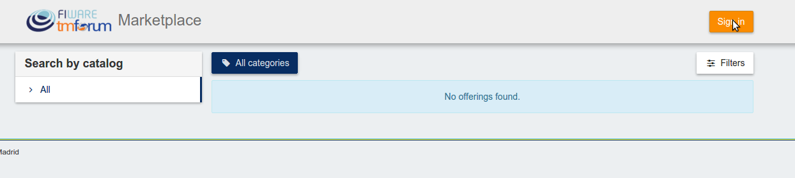

3. Provide your credentials in the IdM page

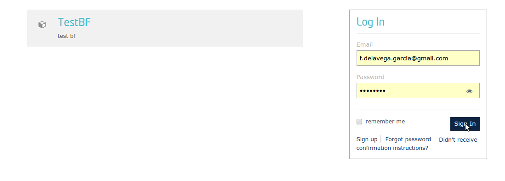

4. Go to the *Revenue Sharing* section

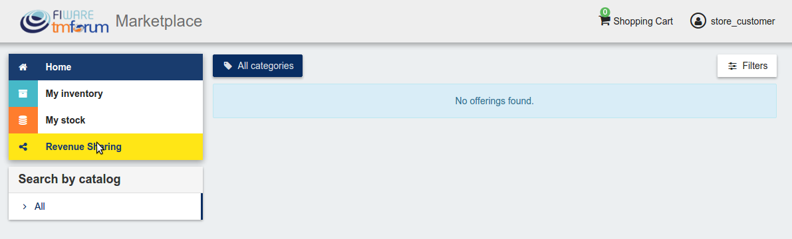

5. Ensure that the default RS Model has been created

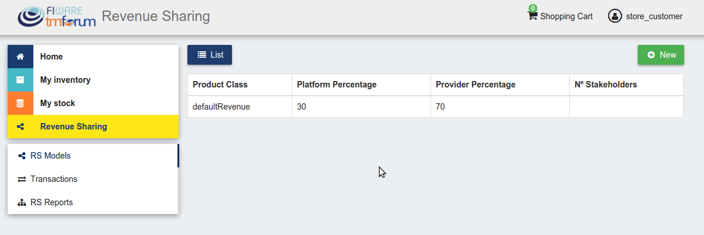

6. Go to *My Stock* section

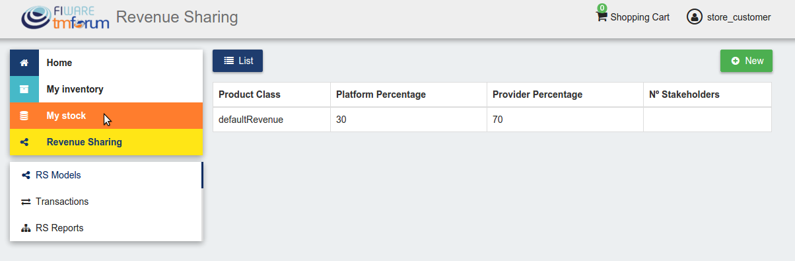

7. Click on *New* for creating a new catalog

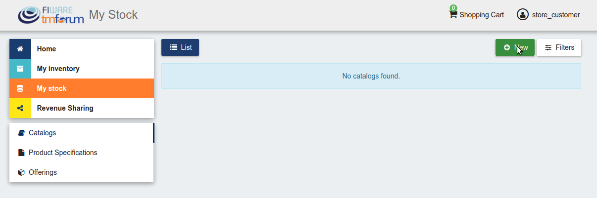

8. Provide a name and a description and click on *Next*. Then click on *Create*

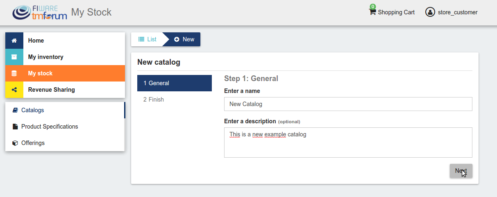
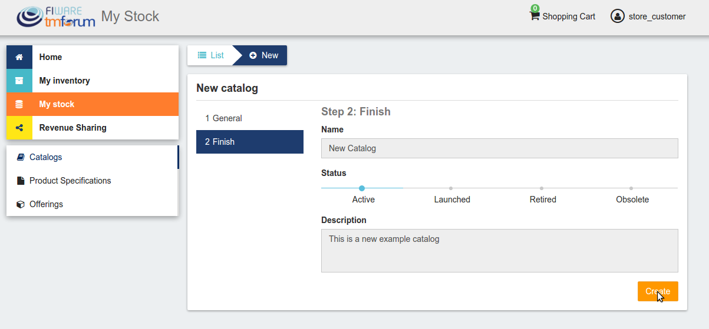
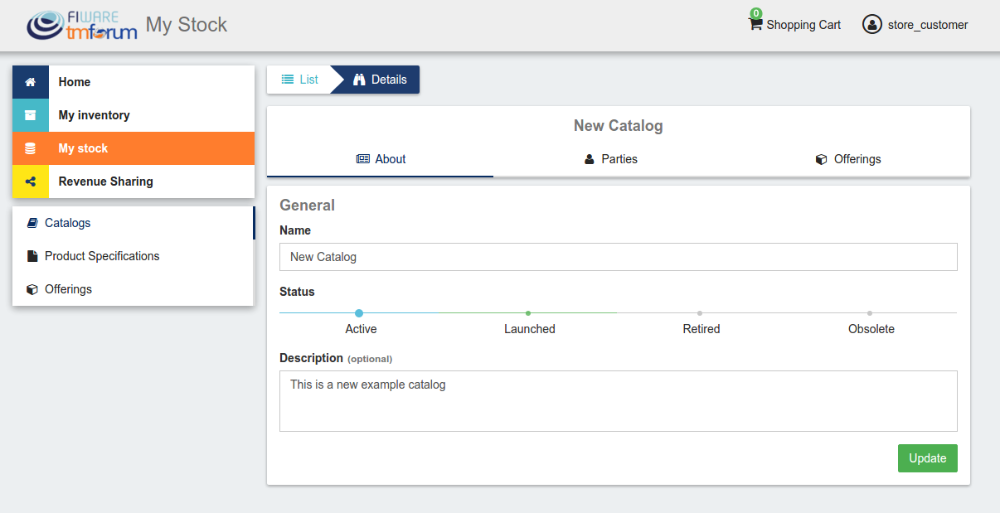

9. Click on *Launched*, and then click on *Update*

10. Go to *Home*, and ensure the new catalog appears

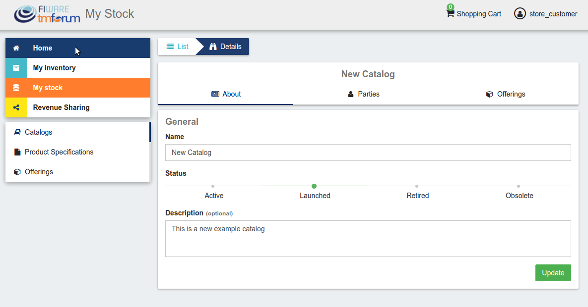
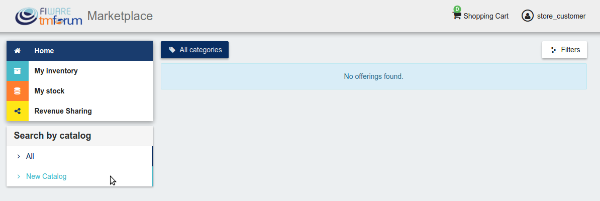

List of Running Processes
=========================

We need to check that Java for the Glassfish server (APIs and RSS), python (Charging Backend) and Node (Proxy) are running,
as well as MongoDB and MySQL databases. If we execute the following command: ::

    ps -ewF | grep 'java\|mongodb\|mysql\|python\|node' | grep -v grep

It should show something similar to the following: ::

    mongodb   1014     1  0 3458593 49996 0 sep08 ?        00:22:30 /usr/bin/mongod --config /etc/mongodb.conf
    mysql     1055     1  0 598728 64884  2 sep08 ?        00:02:21 /usr/sbin/mysqld
    francis+ 15932 27745  0 65187 39668   0 14:53 pts/24   00:00:08 python ./manage.py runserver 0.0.0.0:8006
    francis+ 15939 15932  1 83472 38968   0 14:53 pts/24   00:00:21 /home/user/business-ecosystem-charging-backend/src/virtenv/bin/python ./manage.py runserver 0.0.0.0:8006
    francis+ 16036 15949  0 330473 163556 0 14:54 pts/25   00:00:08 node server.js
    root      1572     1  0 1142607 1314076 3 sep08 ?      00:37:40 /usr/lib/jvm/java-8-oracle/bin/java -cp /opt/biz-ecosystem/glassfish ...

Network interfaces Up & Open
============================

To check the ports in use and listening, execute the command: ::

    $ sudo netstat -nltp

The expected results must be something similar to the following: ::

    Active Internet connections (only servers)
    Proto Recv-Q Send-Q Local Address           Foreign Address         State       PID/Program name
    tcp        0      0 127.0.0.1:8006          0.0.0.0:*               LISTEN      15939/python
    tcp        0      0 127.0.0.1:27017         0.0.0.0:*               LISTEN      1014/mongod
    tcp        0      0 127.0.0.1:28017         0.0.0.0:*               LISTEN      1014/mongod
    tcp        0      0 127.0.0.1:3306          0.0.0.0:*               LISTEN      1055/mysqld
    tcp6       0      0 :::80                   :::*                    LISTEN      16036/node
    tcp6       0      0 :::8686                 :::*                    LISTEN      1572/java
    tcp6       0      0 :::4848                 :::*                    LISTEN      1572/java
    tcp6       0      0 :::8080                 :::*                    LISTEN      1572/java
    tcp6       0      0 :::8181                 :::*                    LISTEN      1572/java

Databases
=========

The last step in the sanity check, once we have identified the processes and ports, is to check that MySQL and MongoDB
databases are up and accepting queries. We can check that MySQL is working, with the following command: ::

    $ mysql -u <user> -p<password>

You should see something similar to: ::

    Welcome to the MySQL monitor.  Commands end with ; or \g.
    Your MySQL connection id is 174
    Server version: 5.5.47-0ubuntu0.14.04.1 (Ubuntu)

    Copyright (c) 2000, 2015, Oracle and/or its affiliates. All rights reserved.

    Oracle is a registered trademark of Oracle Corporation and/or its
    affiliates. Other names may be trademarks of their respective
    owners.

    Type 'help;' or '\h' for help. Type '\c' to clear the current input statement.

    mysql>

For MongoDB, execute the following command: ::

    $ mongo <database> -u <user> -p <password>

You should see something similar to: ::

    MongoDB shell version: 2.4.9
    connecting to: <database>
    >

--------------------
Diagnosis Procedures
--------------------

The Diagnosis Procedures are the first steps that a System Administrator will take to locate the source of an error in a GE.
Once the nature of the error is identified with these tests, the system admin will very often have to resort to more concrete
and specific testing to pinpoint the exact point of error and a possible solution. Such specific testing is out of the scope
of this section.

Resource Availability
=====================

Memory use depends on the number of concurrent users as well as the free memory available and the hard disk.
The Business API Ecosystem requires a minimum of 1024 MB of available RAM memory, but 2048 MB of free memory are recomended.
Moreover, the Business API Ecosystem requires at least 15 GB of hard disk space.

Remote Service Access
=====================

N/A

Resource Consumption
====================

Resource consumption strongly depends on the load, especially on the number of concurrent users logged in.

* Glassfish main memory consumption should be between 500 MB and 2048 MB
* MongoDB main memory consumption should be between 30 MB and 500 MB
* Pyhton main memory consumption should be between 30 MB and 200 MB
* Node main memory consumption should be between 30 MB and 200 MB
* MySQL main memory consumption should be between 30 MB and 500 MB

I/O Flows
=========

The only expected I/O flow is of type HTTP, on port defined in the Logic Proxy configuration file
