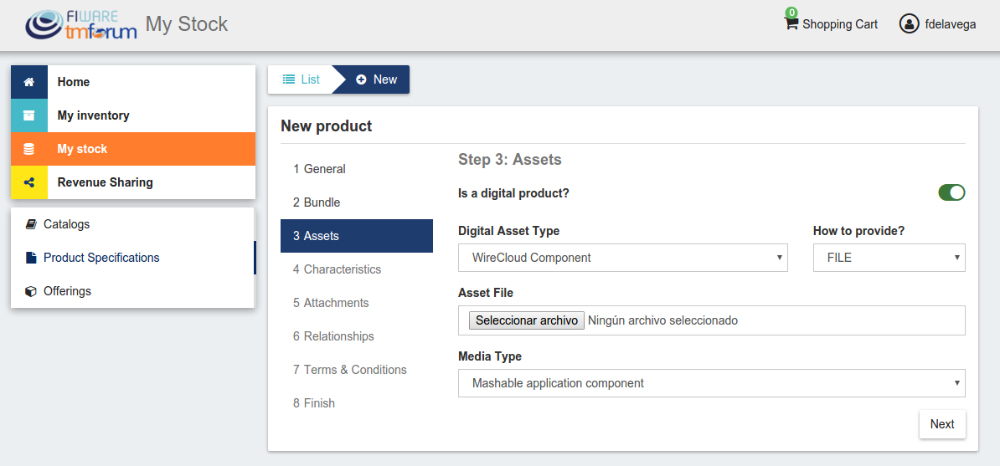
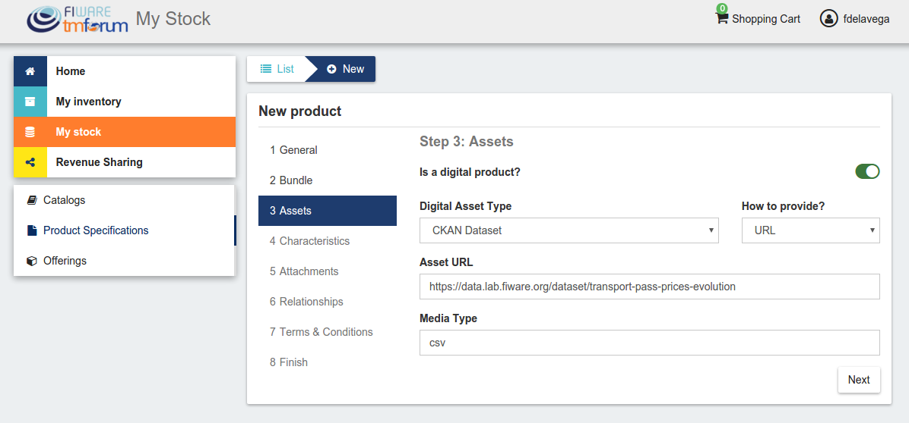
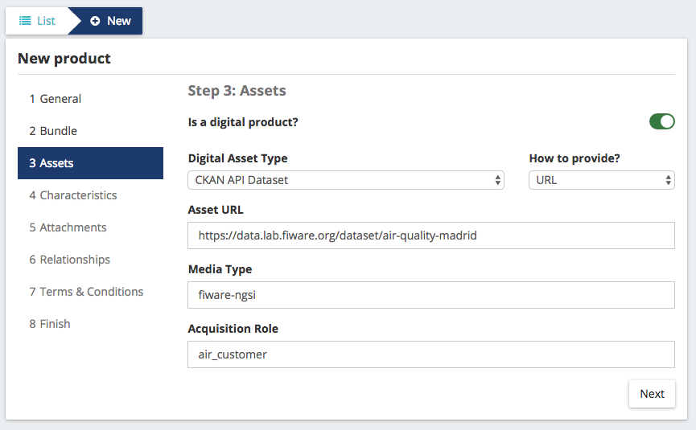
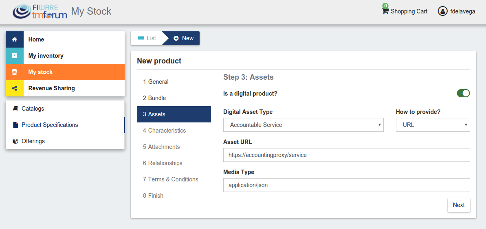

=============
Plugins Guide
=============

------------
Introduction
------------

This plugins guide covers the available plugins (defining digital asset types) for the Business API Ecosystem v6.4.0
Any feedback on this document is highly welcomed, including bugs, typos or things you think should be included but aren't.
Please send them to the "Contact Person" email that appears in the `Catalogue page for this GEi`_. Or create an issue at `GitHub Issues`_

.. _Catalogue page for this GEi: https://catalogue.fiware.org/enablers/business-api-ecosystem-biz-ecosystem-ri
.. _GitHub Issues: https://github.com/FIWARE-TMForum/Business-API-Ecosystem/issues/new

------------------------
Basic File and Basic URL
------------------------

The *Basic File* and *Basic URL* plugins are available at `GitHub <https://github.com/FIWARE-TMForum/biz-basic-plugins>`__
These plugins are intended to enable the creation of digital products in the Business API Ecosystem without the need
of specifying a particular type or validation process. In this regard, these plugins allow the publication of any file
or any URL as digital asset respectively, and can be used for the creation of simple file catalogs or for testing the
Business API Ecosystem.

These plugins do not implement any event handler.

-------------------
WireCloud Component
-------------------

The *WireCloud Component* plugin is available in `GitHub <https://github.com/FIWARE-TMForum/wstore-wirecloud-plugin>`__.
This plugin defines an asset type intended to manage and monetize the different WireCloud components (Widgets, Operators,
and Mashups) in  particular by enabling the creation of product specifications providing the WGT file of the specific
component. (For more details on the WireCloud platform see its documentation in `ReadTheDocs <https://wirecloud.readthedocs.io>`__)

The WireCloud component plugin allows to provide the WGT file in the two ways supported by the Business API Ecosystem,
that is, uploading the WGT file when creating the product and providing a URL where the platform can download the file.

In addition, the plugin only allows the media type *Mashable application component*. Nevertheless, the plugin code uses the WGT
metainfo to determine the type of the WireCloud component (Widget, Operator, or Mashup) and overrides the media type with the
proper one understood by the WireCloud platform (*wirecloud/widget*, *wirecloud/operator* or *wirecloud/mashup*).

This plugin implements the following event handlers:

* **on_post_product_spec_validation**: In this handler the plugin validates the WGT file to ensure that it is a valid WireCloud Component
* **on_post_product_spec_attachment**: In this handler the plugin determines the media type of the WGT file and overrides the media type value in the specific product specification

---------------------------------
CKAN Dataset and CKAN API Dataset
---------------------------------

The *CKAN Dataset* and *CKAN API Dataset* plugins are available in `GitHub <https://github.com/FIWARE-TMForum/biz-ckan-plugin>`__.
These plugins define an asset type intended to manage and monetize datasets offered in a CKAN instance. In particular,
these plugins are able to validate the dataset, validate the rights of the seller creating a product specification to sell
the provided dataset, and manage the access to the dataset of those customers who acquire it.

The difference between both plugins is the type of data included as a resource in the CKAN dataset. In particular,
*CKAN API Dataset* expects the data to be served by an external API secured with the FIWARE security framework. In this
regard, the *CKAN API Dataset* also validates the permissions of the seller in the data service and grants customers access to it
using the FIWARE IdM roles and permissions.

Is important to notice that by default CKAN does not provide a mechanism to publish protected datasets or an API for
managing the access rights to the published datasets. In this regard, the CKAN instance to be monetized has to be extended
with the following CKAN plugins:

* `ckanext-oauth2 <https://github.com/conwetlab/ckanext-oauth2>`__: This extension allows to use an external OAuth2 Identity Manager
  for managing CKAN users. In particular, this extension must be used, in this context, to authenticate users using the same
  FIWARE IdM instance as the specific Business API Ecosystem instance, so both systems (CKAN and Business API Ecosystem)
  share their users.
* `ckanext-privatedatasets <https://github.com/conwetlab/ckanext-privatedatasets>`__: This extension allows to create
  protected datasets in CKAN which can only be accessed by a set of users selected by the dataset owner. Moreover, this
  extension exposes an API that can be used to add or remove authorized users from a dataset.

In addition, if the `ckanext-storepublisher <https://github.com/FIWARE-TMForum/ckanext-storepublisher>`__ plugin is installed
in CKAN, the *CKAN dataset* or *CKAN API Dataset* plugin must be installed in the Business API Ecosystem, since the aforementioned CKAN extension
uses the *CKAN Dataset* or *CKAN API Dataset* asset type (depending on the dataset resource) for creating product specifications.

The *CKAN Dataset* plugin only allows to provide the asset with a URL that must match the dataset URL in CKAN.

This plugin implements the following event handlers:

* **on_pre_product_spec_validation**: In this handler the plugin validates that the provided URL is a valid CKAN dataset and
  that the user creating the product specification is its owner.
* **on_product_acquisition**: In this handler the plugin uses the CKAN instance API in order to grant access to the user
  who has acquired a dataset.
* **on_product_suspension**: In this handler the plugin uses the CKAN instance API in order to revoke access to a dataset
  when a user has not paid or when the user cancels a subscription.

On the other hand, the *CKAN API Dataset* also requires an *Acquisition role* to be provided. This role is the one that
will be granted to customers in the IdM in order to enable their access to the backend service, so the role must exist
and define a proper set of permissions for accessing the data.

This plugins implements the following event handlers:

* **on_pre_product_spec_validation**: In this handler the plugin validates that the provided URL is a valid CKAN dataset and
  that the user creating the product specification is its owner.
* **on_post_product_spec_validation**: In this handler, the plugin validates that the API resources included in the CKAN
  dataset are valid, the permissions of the seller to offer that services, and that the provided acquisition role exist and
  is valid.
* **on_post_product_offering_validation**: In this handler the plugin validates that pricing models are supported when
  creating a pay-per-use offering
* **on_product_acquisition**: In this handler the plugin uses the CKAN instance API in order to grant access to the user
  who has acquired a dataset.
* **on_product_suspension**: In this handler the plugin uses the CKAN instance API in order to revoke access to a dataset
  when a user has not paid or when the user cancels a subscription.
* **get_pending_accounting**: In this handler, the plugins retrieves pending accounting information when the access to the
  data has been acquired under a pay-per-use pricing model.

In addition, the *CKAN API Dataset* requires some settings to be configured before being deployed. This settings are available
in the *setting.py* file, and are:

* **AUTH_METHOD**: Authorization mechanism used by the backend service, *idm* or *umbrella*
* **UMBRELLA_KEY**: API Key used for accessing to the API Umbrella instance used to secure the backend service
* **UMBRELLA_ADMIN_TOKEN**: Admin token used for accessing to the API Umbrella instance used to secure the backend service
* **KEYSTONE_USER**: Keystone user used for authenticate requests to the FIWARE IdM
* **KEYSTONE_PASSWORD**: Keystone password used for authenticate requests to the FIWARE IdM
* **KEYSTONE_HOST**: Host of the Keystone service of the FIWARE IdM used for authorizing customers

-------------------
Accountable Service
-------------------

The *Accountable Service* plugin is available in `GitHub <hhttps://github.com/FIWARE-TMForum/biz-accountable-service-plugin>`__.
This plugin defines a generic asset type which is used jointly with the `Accounting Proxy <https://github.com/FIWARE-TMForum/Accounting-Proxy>`__
in order to offer services under a pay-per-use model. In particular, this plugin is able to validate services URLs,
validate sellers permissions, generate API keys for the Accounting Proxy, validate offering pricing models, and manage
customers access rights to the offered services.

Taking into account that this plugin is intended tyo work coordinately with an instance of the Accounting Proxy, all
the assets to be registered using the *Accountable Service* type must be registered in the proxy as described in the
Accounting Proxy section.

The *Accountable Service* plugin only allows to provide the assets with a URL that must match the service one.

This plugin implements the following event handlers:

* **on_post_product_spec_validation**: In this event handler the plugin validates that the provided URL belongs to a valid
  service registered in an instance of the Accounting Proxy, and that the user creating the product specification is its owner.
  In addition, this handler generates an API key for the Accounting Proxy to be used when it feeds the Business API Ecosystem
  with accounting information.
* **on_post_product_offering_validation**: In this event handler the plugin validates the pricing model of a product offering
  where the service is going to be sold. Specifically, it validates that all the price plans which can be selected by a
  customer are usage models and that the units (calls, seconds, mb, etc) are supported by the Accounting Proxy.
* **on_product_acquisition**: This event handler is used to grant access to a user who has acquired a service by sending
  a notification to the proxy, including also the unit to be accounted (price plan selected).
* **on_product_suspension**: This event handler is used to in order to revoke access to a service when a user has not
  paid or when the user cancels a subscription.

Accounting Proxy
================

The *Accounting Proxy* can be found in `GitHub <https://github.com/FIWARE-TMForum/Accounting-Proxy>`__. This software
is a NodeJs server intended to manage services offered in the Business API Ecosystem. In particular, it is able to
authenticate users, authorize or deny users to access to a particular service depending on the acquisition, the URL,
or the HTTP method used, and account the usage made of the service so users can be charged on pay-per-use basis.

Having this software deployed allows service owners to protect their services and offer them in the Business API Ecosystem
without the need of making any modification in the specific service.

Installation
------------

This software is a pure NodeJS server, to install basic dependencies execute the following command: ::

    $ npm install

Configuration
+++++++++++++

All the Accounting Proxy configuration is saved in the *config.js* file in the root of the project.

In order to have the accounting proxy running it is needed to fill the following information:

* `config.accounting_proxy`: Basic information of the accounting deployment.
   * `https`: set this variable to undefined to start the service over HTTP.
      * `enabled`: set this option to true to start the service over HTTPS and activate the certificate validation for some administration requests (see *Proxy API*).
      * `certFile`: path to the server certificate in PEM format.
      * `keyFile`: path to the private key of the server.
      * `caFile`: path to the CA file.
   * `port`: port where the accounting proxy server is listening.
::

    {
        https: {
            enabled: true,
            certFile: 'ssl/server1.pem',
            keyFile: 'ssl/server1.key',
            caFile: 'ssl/fake_ca.pem'
        },
        port: 9000
    }

* `config.database`: Database configuration used by the proxy.
   * `type`: database type. Two possible options: `./db` (sqlite database) or `./db_Redis` (redis database).
   * `name`: database name. If the database type select is redis, then this field selects the database number (0 to 14; 15 is reserved for testing).
   * `redis_host`: redis database host.
   * `redis_port`: redis database port.

::

    {
        type: './db',
        name: 'accountingDB.sqlite',
        redis_host: 'localhost',
        redis_port: 6379
    }

* `config.modules`:  An array of supported accounting modules for accounting in different ways. Possible options are:
   * `call`: the accounting is incremented in one unit each time the user send a request.
   * `megabyte`: counts the response amount of data (in megabytes).
   * `millisecond`: counts the request duration (in milliseconds).

::

    {
        accounting: [ 'call', 'megabyte', 'millisecond']
    }

Other accounting modules can be implemented and included to the proxy (see  *Accounting modules*).

* `config.usageAPI`: the information of the usage management API where the usage specifications and the accounting information will be sent.
   *`host`: Business API Ecosystem host.
   * `port`: Business API Ecosystem port.
   * `path`: path of the usage management API.
   * `schedule`: defines the daemon service schedule to notify the accounting information to the Business API Ecosystem. The format is similar to the cron tab format:  "MINUTE HOUR DAY_OF_MONTH MONTH_OF_YEAR DAY_OF_WEEK YEAR (optional)". By the default, the usage notifications will be sent every day at 00:00.

::

    {
        host: 'localhost',
        port: 8080,
        path: '/DSUsageManagement/api/usageManagement/v2',
        schedule: '00 00 * * *'
    }

* `config.api.administration_paths`: configuration of the administration paths. Default accounting paths are:

::

    {
        api: {
            administration_paths: {
                keys: '/accounting_proxy/keys',
                units: '/accounting_proxy/units',
                newBuy: '/accounting_proxy/newBuy',
                checkURL: '/accounting_proxy/urls',
                deleteBuy: '/accounting_proxy/deleteBuy'
            }
        }
    }

The Accounting Proxy can be used to proxy an Orion Context Broker, supporting the accounting of subscriptions. To do that,
the following configuration params are used:

* `config.resources`: configuration of the resources accounted by the proxy.
   * `contextBroker`: set this option to `true` if the resource accounted is an Orion Context Broker. Otherwise set this option to `false` (default value).
   * `notification_port`: port where the accounting proxy is listening to subscription notifications from the Orion Context Broker (port 9002 by default).

::

    {
	    contextBroker: true,
	    notification_port: 9002
    }

Administration
--------------

The Accounting Proxy is able to manage multiple services. In this regard, it has been provided a *cli* tool that can be
used by admins in order to register, delete, and manage its services. The available commands are:

* `./cli addService [-c | --context-broker] <publicPath> <url> <appId> <httpMethod> [otherHttpMethods...]`: This command is used to register
  a new service in the Accounting Proxy. It receives the following parameters
    * *publicPath*: Path where the service will be made available to external users. There are two valid patterns for the
      public path: (1) Providing a path with a single component (*/publicpath*) will make the Accounting Proxy accept requests
      to sub-paths of the specified one (i.e having a public path */publicpath* requests to */publicpath/more/path* are accepted).
      This pattern is typically used when you are offering the access to an API with multiple resources. (2) Providing a
      complete path (*/this/is/the/final/resource/path?color=Blue&shape=rectangular*) will make the Accounting Proxy to
      accept only requests to the exact registered path including query strings. This pattern is typically used when you are
      offering a single URL, like a Context Broker query.

    * *url*: URL where your service is actually running and where requests to the proxy will be redirected. Note that in
      this case all the URL is provided (including the host) since the accounting proxy allows the management of services
      running in different servers.

    * *appId*: ID of the service given by the FIWARE IdM. This id is used in order to ensure that the access tokens provided
      by users are valid for the accessed service

    * *HTTP methods*: List of HTTP methods that are allowed to access to the registered service

    * Options:
       * `-c, --context-broker`: the service is an Orion Context broker service (`config.contextBroker` must be set to `true` in `config.js`).

Following you can find two examples in order to clarify the options available for registering a service: ::

    $ ./cli addService /apacheapp http://localhost:5000/ 1111 GET PUT POST

In this case, there is a service running in the port 5000 which is made available though the */apacheapp* path, allowing
only GET, PUT, and POST HTTP request. Supposing that the Accounting Proxy is running in the host *accounting.proxy.com* in the
port 8000, the following requests will be accepted by it: ::

    GET http://accounting.proxy.com:8000/apacheapp
    GET http://accounting.proxy.com:8000/apacheapp/resource1/
    POST http://accounting.proxy.com:8000/apacheapp/resource1/resource2
.. note::
    The Accounting Proxy does not care about the API or the semantics of the monitored service, so it may accept
    a request to a URL which does not exists in the service, resulting in a usual 404 error given by the later

Additionally, a complete path can be provided, as in the following example: ::

    $ ./cli addService /broker/v1/contextEntities/Room2/attributes/temperature http://localhost:1026/v1/contextEntities/Room2/attributes/temperature 1111 GET

In this example, there is a Context Broker running in the port 1026 and a specific query is made available through the
Accounting proxy, so only the following request is accepted: ::

    GET http://accounting.proxy.com:8000/broker/v1/contextEntities/Room2/attributes/temperature

.. note::
    For making the proxy transparent to final users is a good practice to use the same path in the external path and in
    the URL when providing a complete path. Nevertheless, this is not mandatory, so it is possible to create an alias for
    a query (i.e */room2/temperature* for the previous example)

* `./cli getService [-p <publicPath>]`: This command is used to retrieve the URL, the application ID and the type
  (Context Broker or not) of all registered services.

    * Options:
       * `-p, --publicPath <path>`: only displays the information of the specified service.

* `./cli deleteService <publicPath>`: This command is used to delete the service associated with the public path.
* `./cli addAdmin <userId>`: This command is used to add a new administrator.
* `./cli deleteAdmin <userId>`: This command is used to delete the specified admin.
* `./cli bindAdmin <userId> <publicPath>`: This command is used to add the specified administrator to the service specified by the public path.
* `./cli unbindAdmin <userId> <publicPath>`: This command is used to delete the specified administrator for the specified service by its public path.
* `./cli getAdmins <publicPath>`: This command is used to display all the administrators for the specified service.

To display a brief description of the *cli* tool you can use : `./cli -h` or `./cli --help`. In addition, to get
information for a specific command you can use: `./cli help [cmd]`.

Authentication and Authorization
--------------------------------

The Accounting Proxy relies on the FIWARE IdM for authenticating users. To do that, the proxy expects that all the requests
include a header *Authorization: Bearer access_token* or *X-Auth-Token: access_token* with a valid access token given
by the IdM.

Moreover, if the authentication process has succeed, the Accounting Proxy validates the permissions of the user to access
to specific service. To do that, it checks if the user has been registered as an admin of the service or if the user has
acquired the service.

Is important to notice, that the Business API Ecosystem allows sellers to offer a service in different offerings with
different pricing models. In this regard, having just the access token is not enough to determine the accounting unit
(pricing model) that has to be used to account the usage of the service. It may happen, that a valid user has acquired
the access to a service in two different offerings with two different models (i.e calls and seconds), so the proxy
needs extra info to determine the unit to account (in this example calls or seconds). To deal with that problem, the
Accounting Proxy generates an API Key which identifies the service, the user, and the accounting unit, so including
it in a header *X-API-Key: api_key* when making requests, enables it to know what unit to account.

.. note::
    The X-API-Key header is not intended to provide an extra level of security, but just to remove the possible incertitude
    around the request

Proxy API
---------

The Accounting Proxy runs by default in the port 9000; nevertheless, this port can be configured as described in *Configuration*
section. In this regard, the different services configured though the administration *cli* tool can be accessed directly
in the root of the proxy using the public path defined for the service.

In addition, the Accounting Proxy has an administration API which can be accessed though the reserved path */accounting_proxy*.
Following, you can find the different services exposed in the administration API:

POST .../newBuy
+++++++++++++++

This service is used by the Business API Ecosystem to notify a new buy. If the accounting proxy has been started over
HTTPS, these requests should be signed with the Business API Ecosystem key; otherwise, they will be rejected.

::

    {
       "orderId": "...",
       "productId": "...",
       "customer": "...",
       "productSpecification": {
           "url": "...",
           "unit": "...",
           "recordType": "..."
       }
    }

* `orderId`: order identifier.
* `productId`: product identifier.
* `customer`: customer id.
* `url`: base url of the service.
* `unit`: accounting unit (`megabyte`, `call`, etc).
* `recordType`: type of accounting.

POST .../deleteBuy
++++++++++++++++++

This service is used by the Business API Ecosystem to notify a terminated buy. If the accounting proxy has been started over HTTPS, these
requests should be signed with the Business API Ecosystem key; otherwise, they will be rejected.

::

    {
       "orderId": "...",
       "productId": "...",
       "customer": "...",
       "productSpecification": {
          "url": "..."
       }
    }

* `orderId`: order identifier.
* `productId`: product identifier.
* `customer`: customer id.
* `url`: base url of the service.

POST .../urls
+++++++++++++

This service is used by the Business API Ecosystem to check if an URL is a valid registered service. This requests require
the "authorization" header with a valid access token from the IdM and the user must be an administrator of the service.
If the accounting proxy has been started over HTTPS, these requests should be signed with the Business API Ecosystem key cert; otherwise,
they will be rejected.

::

    {
       "url": "..."
    }

GET .../keys
++++++++++++

Retrieve the user's API_KEYs in a json. This request require the "authorization" header with a valid access token from the IdM.

::

    [
	    {
            "apiKey": "...",
            "productId": "...",
            "orderId": "...",
            "url": "..."
        },
        {
            "apiKey": "...",
            "productId": "...",
            "orderId": "...",
            "url": "..."
        }
    ]

GET .../units
+++++++++++++

Retrieve the supported accounting units by the accounting proxy in a JSON. This requests require the "authorization"
header with a valid access token from the IdM.

::

    {
	    "units": ["..."]
    }

Accounting modules
------------------

By default, the Accounting Proxy includes three different modules for accounting. Nevertheless, it is possible to extend
the proxy with new modules by creating them in the *acc_modules* directory, those modules have to have the following structure:

::

    /** Accounting module for unit: XXXXXX */

    var count = function (countInfo, callback) {
        // Code to do the accounting goes here
        // .....

        return callback(error, amount);
    }

    var getSpecification = function () {
        return specification;
    }

The function `count` receives two parameters:
* `countInfo`: object containing both, the request made by the user and the response returned by the service ::

    {
        request: { // Request object used by the proxy to make the request to the service.
            headers: {

            },
            body: {

            },
            ...
        },
        response: { // Response object received from the service.
            headers: {

            },
            body: {

            },
            elapsedTime: , // Response time
            ...
        }
    }

* `callback`: function, which is used to retrieve the accounting value or the error message. The callback expects 2 parameters:
   * `error`: string with a description of the error if there is one. Otherwise, `null`.
   * `amount`: number with the amount to be added to the current accounting.

The function `getSpecification` should return a javascript object with the usage specification for the accounting unit
according to the TMF635 usage management API (`TMF635 usage Management API <https://www.tmforum.org/resources/standard/tmf635-usage-management-api-rest-specification-r14-5-0/>`__).

Finally, add the name of the developed accounting module to the `config.modules` array in the `config.js` file (the
accounting module name is the name of the file, e.g. `megabyte` and `megabyte.js`) and restart the Accounting Proxy.
